### Hello World 👋
I'm a Web Developer who's got intesrest in Interective Web and Modern JS  

•  Sahmyook University 2019 ~ 2026 | Bachelor's Degree on Computer Science 
•  GDGoC Sahmyook 2024 ~ 2026 
•  K-Digital Training 2025 | Radiology API related Fullstack Developer Course with Java

**Blog**   
 

## 🧱 MyStacks
### 🌐 Language

	

### 🔧 Tools

  
  

## 🔭 현재 참여/진행중인 프로젝트
<h3>Hum</h3>

사람은 하루에 약 <b>2시간</b> 정도를 음악을 듣는다는 통계가있습니다.  
출퇴근 시간, 등하교 시간이 주로 음악을 듣는시간이죠.  
하지만 우리에게 24시간이라는  시간은 다소 부족한</b> 면이 있습니다.  
<b>"우리가 듣는 외국 노래들로 단어장을 만들면 시간을 최대한 활용 할 수 있지 않을까?"</b>  
라는 물음에서 시작한, Now Playing 기반 단어장 생성 서비스입니다.  
 

<h3>Mailable</h3>

많은 소규모 행사들에선 현재 <b>Google Form</b> 를 활용해서 신청을 받고  
이에 연계되는 <b>Google Sheets</b> 를 활용하여 참여자를 관리하고  
확인 이메일을 수동으로 매번 <b>복사/붙여넣기</b> 하여 보냅니다.  
<b>"Google Sheets 데이터만 가져올 수 있다면. 하나에 사이트에서 해결할 수 있지 않을까?"</b> 라는 작은 불편함을 해결하고자 시작한 프로젝트입니다. 

 

<!--
**Jaek-Kein/Jaek-Kein** is a ✨ _special_ ✨ repository because its `README.md` (this file) appears on your GitHub profile.
 
(https://img.shields.io/badge/kotlin-%237F52FF?style=for-the-badge&logo=kotlin&logoColor=white) 

Here are some ideas to get you started:

- 🔭 I’m currently working on ...
- 🌱 I’m currently learning ...
- 👯 I’m looking to collaborate on ...
- 🤔 I’m looking for help with ...
- 💬 Ask me about ...
- 📫 How to reach me: ...
- 😄 Pronouns: ...
- ⚡ Fun fact: ...
-->
